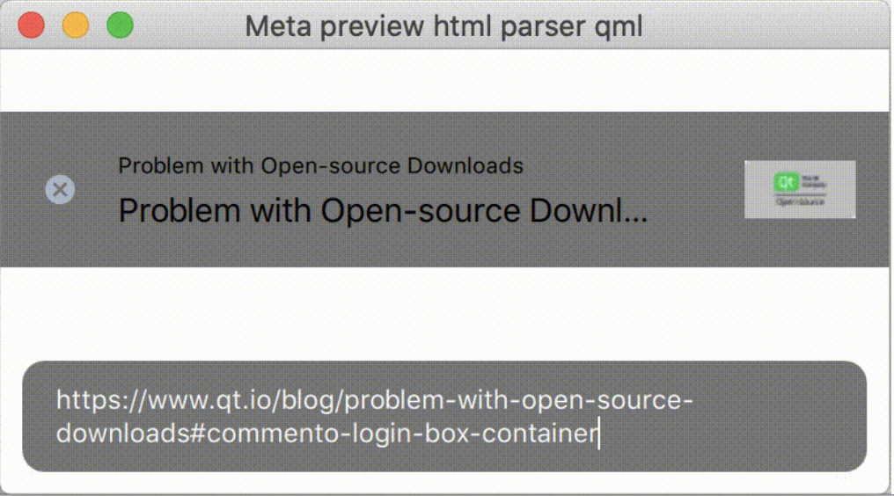
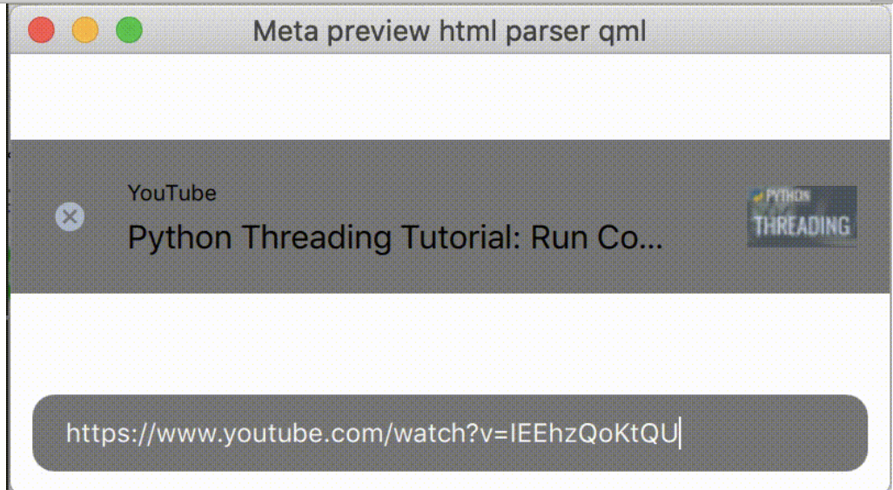

# meta-tag-parser-qml
Meta-tag html parser built on qml

It is an example, how to make a preview from an url, grabbing the information such as title and image

I could not find a project like jsoup for c ++ / qt

So I made this simple example

## Visual Examples

## Requirements
* Qt 5.15.2 and later

Contact me either by email (khominvladimir@yandex.ru) or Skype (fedorgolyb)
